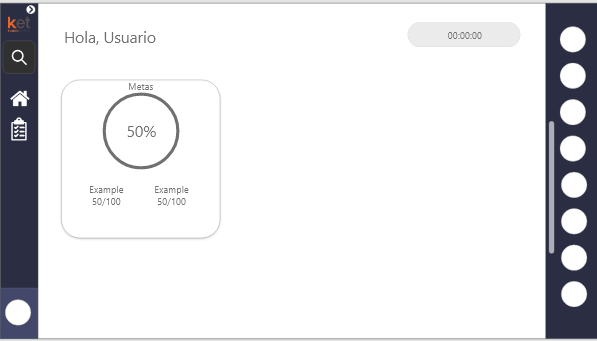
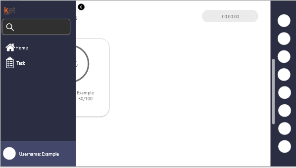

# KuepaTest

This test was developed on 06/08/2022 for a junior job offer, I experimented with new things and used several methods that I learned from react and bootstrap. For this test we are asked to create a user interface where he could see the percentage of his tasks done and those that remain to be done, in addition to being able to see a list of friends.

---

## Design
Based on the above, create an interactive adobe xd design where you try to simulate the requested scenario as a high-end prototype that you see below:

The prototype is simple to understand and easy to use for different types of users.